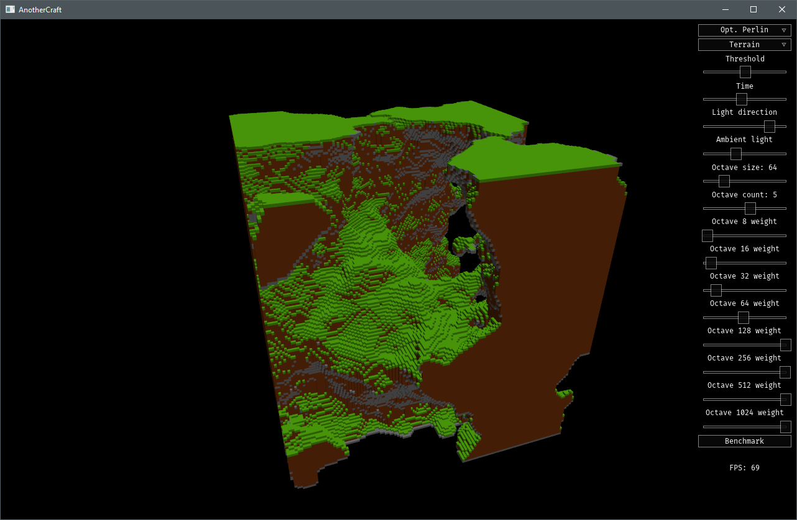

# Voxel noises
This is a simple application written in D with some algorithms used for procedural generation (Perlin noise, Simplex noise, Voronoi). Results are visualized as voxel terrain. Generating is completely done on the GPU using the OpenGL compute shaders. The shaders can be found in `res/shader`.

I've also written a paper on optimizing the Perlin Noise on the GPU, you can find it [here]{optimizigPerlinNoise_paper_CZ.pdf}. It is in Czech though :P

Perlin and Simplex noise implementations from [Stefan Gustavson](https://github.com/ashima/webgl-noise) are also present in this application. So credits for that goes to him (the [Ashima] and [Ashima simplex] in the application). Btw, my 3D Perlin noise GLSL implemlentation uses thread cooperation and is about 3x faster than Stefan's.

Also check my Minecraft clone master thesis using these noises [here](https://github.com/CZDanol/AnotherCraft).

[Video here](https://www.youtube.com/watch?v=6iHqdHksTco&feature=youtu.be)

## How to build this project
1. Download appropriate binaries from http://dsfml.com/downloads.html
2. Put all .lib, .so and .a files from from `archive/lib` to the `lib` folder
3. Put all the .dll files to the `bin folder`
4. Download D language compiler (dmd from http://dlang.org , `sudo apt-get install dmd`)
5. In the project folder, execute `dub build`
6. Run the program in the `bin` folder

Tested on win86
